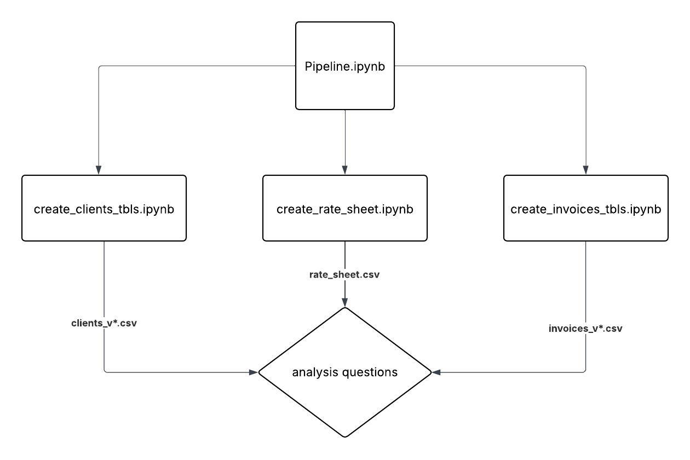

# How to run pipeline
The actual “pipeline” is essentially the Pipeline notebook that triggers the individual pieces. Run the “pipeline” notebook to get all the notebook outputs. Open and run the individual notebooks to see how they are ran. All dependencies are included in the **requirements.txt**.

  
   
  <em>Pipeline Diagram: End-to-End Data Flow
   This is how I would set this pipeline up in a real data orchestrating tool</em>

# Example outputs for analysis queries
##### Please see ./analysis questions.ipynb for derivation of answers!
1. Basic: Which top 5 clients have the largest total invoice amounts outstanding?
    - [Show Answer 1 CSV](output_tables/answer1.csv)

2. Intermediate: Show the month-over-month invoice growth per client for 2024–2025.
    - [Show Answer 2 CSV](output_tables/answer2.csv)
3. Discount Scenario: Show total costs for each client, if discounts were applied:
    - 20% off GROUND, then, who are the new top 5 spenders?
      - [Show Answer 3 part A CSV](output_tables/answer3parta.csv) 
    - 30% off FREIGHT, then, who are the new top 5 spenders?
      - [Show Answer 3 part B CSV](output_tables/answer3partb.csv) 
    - 50% off 2 DAY, then, who are the new top 5 spenders?
      - [Show Answer 3 part C CSV](output_tables/answer3partc.csv) 
4. Reclassification Scenario: Suppose all “EXPRESS” shipments were instead billed as “GROUND” (lower cost).
    - What is the total cost savings opportunity per client?
      - [Show Answer 4 part A CSV](output_tables/answer4parta.csv) 
    - Which clients have >50% savings?
      - [Show Answer 4 part B CSV](output_tables/answer4partb.csv)
      - *No clients have saved more than 50%*
    - Which clients have >$500k savings?
      - [Show Answer 4 part C CSV](output_tables/answer4partc.csv) 

# Assumptions made & Design Choices
- To parse PDFs, I used tabula-py package as I was going to use pandas to manage the datasets.
- For both invoices and clients, I created a script that checked whether the file type is a pdf or csv, and depending on which then I would create a pandas dataframe using different processes.
- After picking up the pandas dataframe, I would then use specific functions to try to find key columns such as client_id, company_name, the date column, shipment_type, and invoice_id.
  - These individual functions would look at the data in the column and not the column name. Based off the data in the column it would rename the column to a standardized name.
- For the date columns, I used normalize_date_col() where I would clean up all the date formats to a consistent yyyy-mm-dd format.
- For string columns, I used normalize_str_col() where I would replace any string NONE and NAN with np.nan to truly represent NULL values.
  - I was able to find a misrepresented NULL value in the clients pdf source.
- Int/Float columns were left as is.
  - I did try to standardize the "total_amount" column from the invoices tables by taking the numeric column thats in USD format (0.00) with the highest sum, but I realized thats not a good design as a column in USD format may be used. The sum may be higher than the total_amount column.

- Originally I wanted to do the following to the clients table:
  - I found that there was rows in the joined clients.csv table where it had the same company_name, but it had a variation where one row was “INACTIVE” and the other row was “ACTIVE” status. I wanted to keep the ACTIVE row and drop the INACTIVE row as I was originally assuming that the INACTIVE entry is "expired".
  - I found that some companies had multiple active rows where one tier was higher than the other. I wanted to take the higher tier and drop the lower tier and ranked the tiers in the following: GOLD > SILVER > BRONZE > None.
  - I found that some companies had active rows with the same tier, I wanted to take the most recent entry. I assumed that the company bought the same tier again but the system failed to remove the older entry.
  - I wanted to drop rows that are inactive companies with NULL values in tier AND invalid active_flag value (not Y or N). As they may create data issues down the pipeline. I considered these companies as invalid and I wanted to enforce that all companies to have Y or N in the active_flag column via a validation check       I created in validate_save_df().
- All these ideas were scrapped after I found entries in the invoice table where orders were made in 2024-01-01 through 2025-12-31 from all the client_ids, **including ALL of those that I was targetting to drop.** I really thought about how is it possible that a company made an order while they are in inactive. To me the most logical reason is that the company placed all of these orders before they became inactive. I thought it was best to not drop any client_ids to preserve those orders for when its time to join the clients with invoices table.

- What I stuck with:
  - If a company has the same client_id value in the table as two different rows & tiers, then I am going to assume they signed up for the higher available tier available. Meaning that I do not need to keep records of the lower tier as long as the client_id is the same for both entries
  - **For missing tier:** If a company does not have a value in the tier column, but are labeled as ACTIVE in status column, then I am going to assume that BRONZE is the entry level tier and those active companies are BRONZE tier
    - Therefore, I filled in those NULLs with "BRONZE" where active_flag == 'Y'
  - **For missing status and active_flag:** Im going to assume status is INACTIVE and active_flag is N as long as tier is NULL because if the company were to be active, it would of had a tier
    - Therefore, I filled in NULL status values with 'INACTIVE' and NULL active_flag values with 'N' where tier is NULL
  - I did think about forward filling these missing values but there wasnt a clear pattern to follow where I was able to assume why these missing values exist. Forward filling would guarantee inaccuracy in this case
- Validation checks:
  - I believe that every stage of data engineering needs to have validation checks in place before writing to the final table. There was not a validation check placed in analysis questions notebook because there was no final table being written and outputted into the database (file system).
  - I used a MOCK dataset for both client and invoices notebooks to test my validation tests.
  - **Client_id validation check**: I checked in create_clients_tbls whether all of the client_ids were in valid format. This was because I did not want to have invalid values in a key column. That would bring problems further down the line in future processes.
  - **Invoice_id validation check**: I checked in create_invoices_tbls whether all invoice_ids wre in valid format as well for the same reason of futureproofing against issues.
  - However for more complex datasets, I would want a lot more different validation checks such as:
    - NULL values check: Make sure certain columns such as client_id do not have NULL values
    - Duplicate keys check: Make sure there is one unique value per combination of key columns (one row per invoice_id, client_id combo)
    - Invalid values check: Make sure only certain values exist in a column (Only 'Y' and 'N' for active_flag)
- For the analysis queries, I am assuming every client is represented per client_id value and not by company_name. I assume that the reason these companies have multiple client_ids is because there may be different business needs required by the company.

- create_rate_sheet notebook
  - I decided to make this notebook to allow the edits of the rate sheet table values. Maybe the company will come up with a new shipment type. Maybe the prices will need to be updated. At the end of the day, it is better to provide an easy option to update the values instead of hard coding them into the notebooks.

# What I would do differently for production code
1. I would investigate and test tabula-py more before using it in production code and consider other options.
    - It did give me early issues and was crashing my kernel.
2. I would not use Jupyter Notebooks to orchestrate this dataflow. I want to be able to run some notebooks simultaneously.
3. I would want an easily editable JSON file with config information to control project values such as rate sheet prices.
    - Control of validation checks can also be done through JSON config files.
4. I would have the output_tables be divided by type (clients, invoices, etc.).
5. In Production, I would add some logging functions to keep track of failures. I would 100% create a function that sends the team an email alert over failures in the ETL pipeline.
